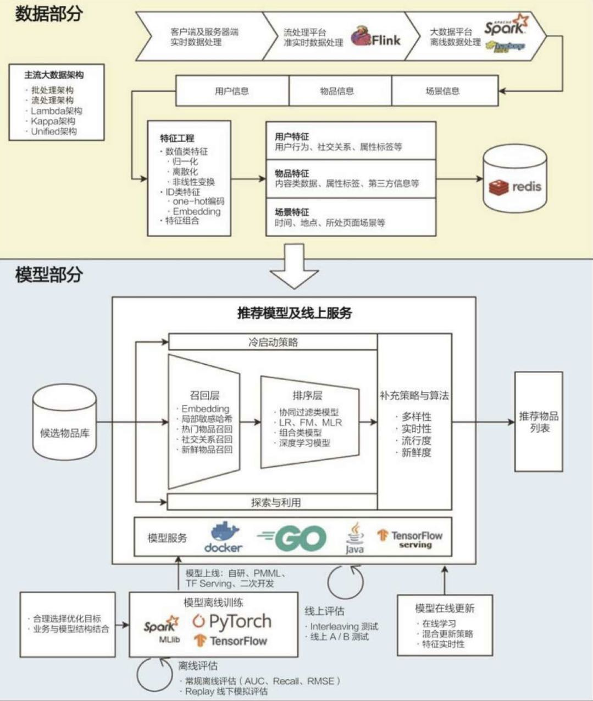

## H2 header
#### H4 header

> Variety is the spice of life.

[Github's URL](https://github.com)

[another markdown file](./m2.md)

##### Picture from the directory



##### Picture from the internet


```c++
std::cout << "Hello world !" << std::endl;
```

* code
* quote

1. numbered list
2. table


| number | content |
| ------ | ------- |
| 1st  | c1   |
| 2nd  | c2 |


**bold text** 

*italic text* 

---

___

~~strikethrough text~~


